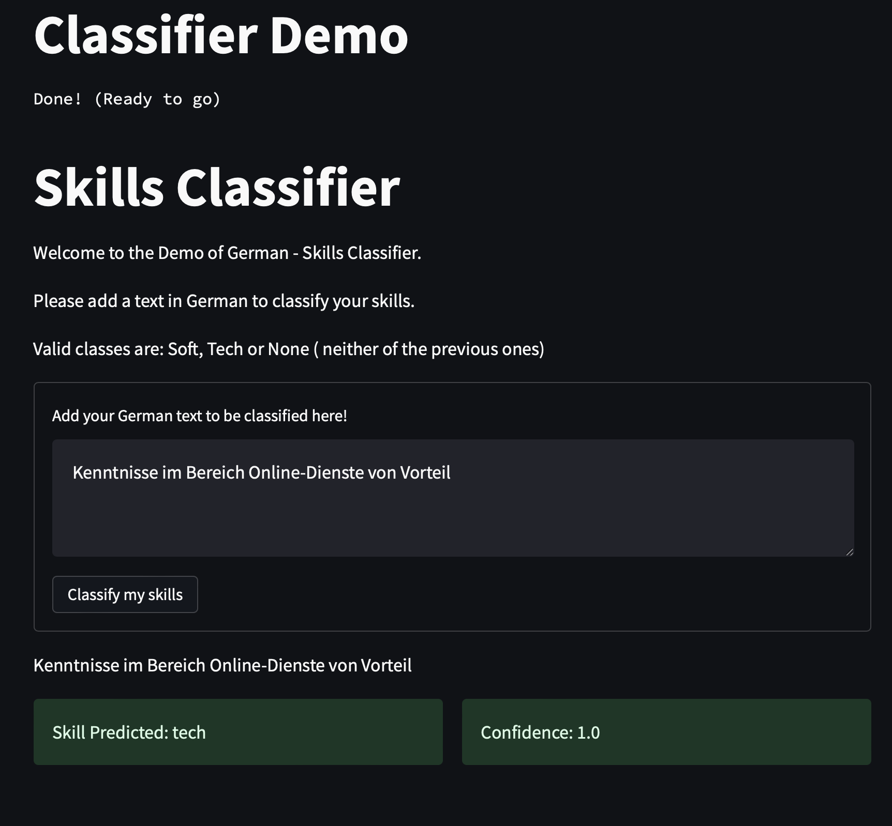

# Skills Classifier 

Skills classifier assignment challenge

Table of contents 

In the following document you will find all the information related to how the challenge was implemented along with a Demo Application. 

## 1. Notebooks 

#### a. [Exploratory Data Analysis](./skill_classifier/01-eda.ipynb)

On this notebook you will have all the findings for getting a feel about the data with respect to :

* shape 
* size
* format 
* distribution per class
* top frequent words
* most uncommon word among others

## 1.1 Data Processing Notebooks 

#### b. [Data Preprocessing - No Cleaning](./skill_classifier/02-pre-processing-no_cleaning.ipynb)

Over this notebook, few tasks for processing the data were performed, such as: 

* normalizing the text
* deleting duplicates
* processes the labels to be in the format required by spaCy ( dummy features )
* Splitting the data into training, validation and testing. 
* Save the data separately to be able to use it at modeling phase.

#### c. [Data Preprocessing - Cleaning](./skill_classifier/02-pre-processing-clean.ipynb)

The difference with the previous notebook is that the text used for saving the data was the Normalized Text by removing the punctuation, stop words and lemmatizing.

#### d. [Feature Extractor using BERT](./skill_classifier/03_transformer_model_bert_feature_extractor.ipynb)

This notebook is an intermediate step with the purpose of implementing and training a Feature Extractor using BERT (german-bert) model. 

With this feature extractor, I was able to build numpy vectors that will serve for creating the baselines model

---------------

## 1.2 Modeling Notebooks 

### a. [Majority Class Baseline](./skill_classifier/03_Baseline_Logistic_Regression.ipynb)

All the work done with scikit learn to predict always the majority class. 

* Hypothesis: the models should be able to outperform the dummy classifier 

### b. [Logistic Regression Classifier](./skill_classifier/03_Baseline_Logistic_Regression.ipynb)

Logistic Regression model was selected as one of the widely used classifier algorithms. 

* Hypothesis: Logistic regression should outperform the dummy classifier but not the Transformer Models 

### c. [spaCy Ensemble Model - No Cleaning](./skill_classifier/03_text_categorizer_model.ipynb)

Using spaCy to leverage NLP processing pipeline and categorizers to build the model with the german model trained on news (large)

* Hypothesis: The processing pipelines and model trained on german should perform really well on the dataset but no better than the one with Clean Data 

### d. [spaCy Ensemble Model - with Cleaning](./skill_classifier/03_textcat_with_clean_text.ipynb)

Using spaCy to leverage NLP processing pipeline and categorizers to build the model with the german model trained on news (large). 

This model differs from the previous as the text data was normalized by removing stopwords, punctuation and applying lemmatiztion.

* Hypothesis: The processing pipelines and model trained on german should perform really well on the dataset better than Baselines and spaCy model with raw data, due to cleaning 

### e. [HuggingFace BERT Transfomer Model](./skill_classifier/03_transformer_model_bert.ipynb)

Transformer models usually perform as state-of-the-art models for NLP and many other tasks. 

* Hypothesis: this model trained on BERT with German dataset should be able to outperform any other model

---------------
## 1.3 Result Notebook 

### a. [Results Notebook](./skill_classifier/04-Results.ipynb)

All the results and insights product of the work for designing and building the models along with the evaluation for each of them are on this notebook.

---------------------

## 1.4. Instructions for Running the notebooks

1. From your Terminal run the following, to create the conda environment

    ```shell
    # create the environment
    
    conda env create -f dev_environment.yml
    
    conda activate skills-dev

    python -m spacy download de_core_news_lg
    #
    ```
2. Run jupyter to be able to check out the notebooks 

    ```shell
    jupyter notebook -p 8888
    ```

**Important Note**: 
- The notebooks related to the models with spaCy and BERT where run in Google Colab, therefore it might need adjustments regarding the data and uploading the best models to your Google Drive. 
- Due to time constraint I was not able to set it for using it local vs. Colab. 

## 2. Demo Application

### 2.1 Instructions for Running the Demo

1. Download the Model: 

```
mkdir -p ./skill_classifier/models/
gdown -O ./skill_classifier/models/1re6-ybn-fxdLIZMATWDVsk7M9ceJB213
tar -xzvf ./skill_classifier/models/best_model_bertv1.tar.gz -C ./skill_classifier/models/
```

2. Run Locally:

```shell
    streamlit run Home.py
```

<center></center>

## 3. Conclusions 

- The challenge was a really good experience to work with. I'm looking forward to discuss the results.
- With this challenge I was able to push forward and build an small demo with Streamlit. 

### Further improvements 

- Pack the application into a Docker Container and upload it to a cloud service. 
- Improve the models by doing Error Analysis and handle properly class imbalance.

